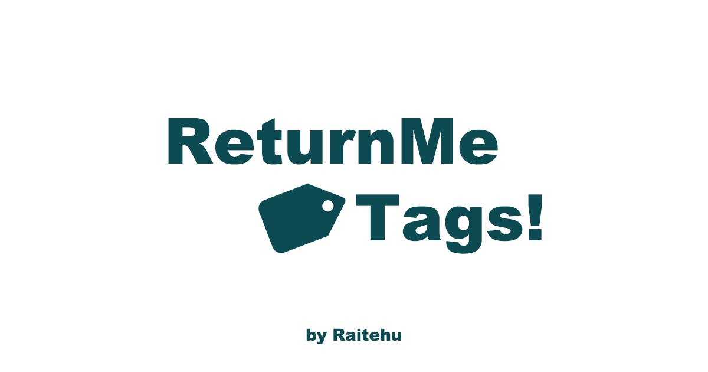

<h1 align="center">
  
</h1>

## ReturnMeTags! とは

ReturnMeTags! は、迷子になった持ち物が戻ってくる確率を高める「連絡先付きタグ」を、ブラウザだけで手軽に作成できるジェネレーターです。名前・連絡先・カラー・フォントを入力すると、L版サイズにぴったり敷き詰めたタグシートを生成し、PNGとしてダウンロードできます。生成された画像は完全にクライアントサイドで処理され、送信や保存は行われません。ネットプリントなどでシール用紙に印刷すれば、そのまま持ち物に貼って使えます。

## 主な機能

- お名前・連絡先・カラー・フォントを入力するだけで即座にタグシートをプレビュー
- PNG ダウンロード機能（生成中はローディングオーバーレイで視覚的に通知）
- 生成したタグをそのまま X でシェアできるリンクボタン
- すべての処理はブラウザ内で完結し、個人情報は外部送信されません

## ローカル開発

### 必要環境

- Node.js 18 以上（開発では v18.12.0、Docker ビルドでは node:20-alpine を利用しています）
- npm 10 以上
- 推奨: 最新版の Google Chrome / Microsoft Edge などモダンブラウザ

```bash
npm install
npm run dev
```

ブラウザで http://localhost:3000 を開くとアプリを確認できます。

## テスト

Jest を利用したコンポーネントテストがセットアップされています。

```bash
npm test
```

## 静的ビルドとデプロイ

Next.js の `output: export` 設定を使用しているため、以下で静的ファイルを生成できます。

```bash
npm run build
```

生成物は `out/` に書き出され、静的ホスティングサービスへそのままアップロードできます。Docker イメージでも同じ `out/` を nginx で配信しています。

## Docker を使った開発の始め方

1. リポジトリをクローンします。
   ```bash
   git clone <your-repo-url>
   cd <your-repo-dir>
   ```
2. Docker イメージをビルドします。
   ```bash
   docker build -t qr-name-tag:latest .
   ```
3. コンテナを起動します。
   ```bash
   docker run --rm -it -p 3000:80 qr-name-tag:latest
   ```
4. ブラウザで http://localhost:3000 を開き、ReturnMeTags! を確認します。

開発コンテナを停止する場合は、ターミナルで `Ctrl+C` を押してください。
